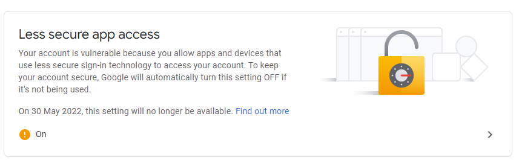
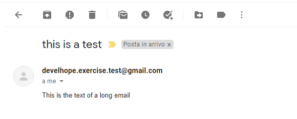

# Esercizio - Spring Boot - Email 1
* crea un account Gmail personalizzato utilizzando una nuova email e una nuova password (non pubblicarle su GitHub o altri luoghi pubblici!)
* per utilizzare l'SMTP di Gmail devi consentire `App meno sicure` (puoi trovare l'opzione nelle nuove impostazioni di sicurezza dell'account Google)
  * vedi immagine seguente:

* se Gmail non ti consente di avere "App meno sicure", puoi utilizzare un servizio come [SendGrid](https://sendgrid.com/)
* scrivere un'applicazione Spring Boot con le dipendenze necessarie che:
  * ha tutta la configurazione SMTP di posta elettronica necessaria in `application.yml`
  * definisce un'entità "Student" con le seguenti proprietà di stringa:
    * `id`
    * `nome`
    * `cognome`
    * `e-mail`
  * definisce uno `StudentService` che ha:
    * una lista di 4 studenti, dove il primo sei tu (con la tua email)
    * un metodo `getStudentById` che restituisce lo `Student` se è presente nella lista
  * espone sotto la "notifica" di mappatura un endpoint per l'invio di un'e-mail a uno specifico "Studente".
    * usa un `try/catch` nel controller dedicato
    * se l'id dello `Studente` è già nell'elenco, invia l'e-mail a quell'utente
    * in caso contrario, rispondi con un messaggio `BAD_REQUEST`
    * se la richiesta non è corretta, rispondi con una risposta HTTP di errore 500
  * definisce un `NotificationDTO` che consiste nelle seguenti stringhe:
    * `ID contatto`
    * `titolo`
    * `testo`
* testare l'endpoint con `Postman`:
  * invia email ad un utente presente nella lista (tu!)
  * prova ad inviare email ad un utente che non è presente nella lista
  * prova a inviare e-mail con un payload errato
* dovresti ricevere un'e-mail come questa:

* **nota per i revisori**: visualizza `Email1.postman_collection.json` nella cartella principale per tutte le chiamate `Postman`

# Exercise - Spring Boot - Email 1
* create a custom Gmail account using a new email and a new password (do not publish them on GitHub or other public places!)
* in order to use Gmail's SMTP you have to allow `Less secure apps` (you can find the option in the new Google account security settings)
  * see following picture:

* if Gmail is not allowing you to have `Less secure apps`, you can use a service like [SendGrid](https://sendgrid.com/)
* write a Spring Boot application with the necessary dependencies that:
  * has all the necessary email SMTP configuration in `application.yml`
  * defines an entity `Student` with the following string properties:
    * `id`
    * `name`
    * `surname`
    * `email`
  * defines a `StudentService` that has:
    * a list of 4 `Student`s, where the first one is you (with your email)
    * a method `getStudentById` that returns the `Student` if it's present in the list
  * exposes under the mapping `notification` an endpoint for sending an email to a specific `Student`
    * use a `try/catch` in the dedicated controller
    * if the id of the `Student` is already in the list, then send the email to that user
    * if not, reply with a `BAD_REQUEST` message
    * if the request is not correct, reply with an error 500 HTTP response
  * defines a `NotificationDTO` that consists of the following strings:
    * `contactId`
    * `title`
    * `text`
* test the endpoint with `Postman`:
  * send email to a user that is present in the list (you!)
  * try to send email to a user that is not present in the list
  * try to send email with a wrong payload
* you should receive an email like this:

* **note for reviewers**: view `Email1.postman_collection.json` in the root folder for all the `Postman` calls
